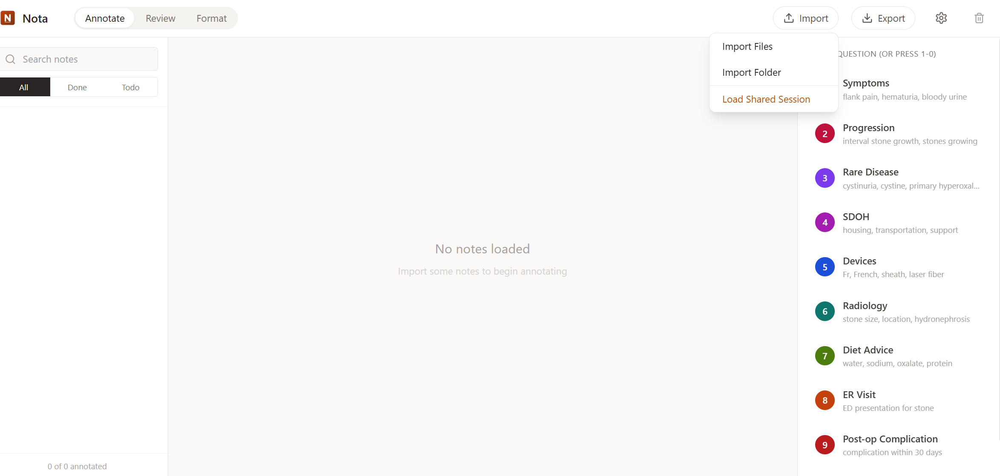

# Nota

Local clinical note annotation tool. All data stays on your machine.



## Features

### Annotation Mode
- **Notes panel** (left): Browse, search, and filter your imported notes
- **Document view** (center): Read and highlight text spans
- **Questions panel** (right): Tag highlights with clinical questions using hotkeys 1-0

### Review Mode
- See all annotations grouped by question
- Jump to any annotation in context
- Edit or delete annotations

### Format Mode
- Bulk upload raw clinical notes (.txt files)
- Auto-format with section header detection
- Side-by-side before/after preview
- Load formatted notes directly into annotator

### Session Sharing
- Export full session (notes + annotations + settings) as JSON
- Share with collaborators who can load the exact same state
- All data stays local - safe for PHI

### Persistent Storage
- Auto-saves after every action
- Survives app close and computer restart
- No manual saving required

## Quick Start

```bash
cd nota
bun install
bun dev
```

Opens at http://localhost:3000

## Download

Pre-built executables available on the [releases page](https://github.com/editnori/nota/releases):

| Platform | Download |
|----------|----------|
| Windows | `Nota_x.x.x_x64-setup.exe` or `.msi` |
| macOS (Apple Silicon) | `Nota_x.x.x_aarch64.dmg` |
| macOS (Intel) | `Nota_x.x.x_x64.dmg` |
| Linux (Debian/Ubuntu) | `Nota_x.x.x_amd64.deb` |
| Linux (Fedora/RHEL) | `Nota_x.x.x.x86_64.rpm` |
| Linux (Universal) | `Nota_x.x.x_amd64.AppImage` |

## Keyboard Shortcuts

| Key | Action |
|-----|--------|
| 1-0 | Tag selection with question 1-10 |
| ←/→ | Previous/next note |
| Tab | Cycle between modes |

## Clinical Questions (Default)

The default questions are based on kidney stone disease research:

1. **Symptoms** - flank pain, hematuria, bloody urine
2. **Progression** - interval stone growth, stones growing
3. **Rare Disease** - cystinuria, cystine, primary hyperoxaluria
4. **SDOH** - housing, transportation, support
5. **Devices** - Fr, French, sheath, laser fiber
6. **Radiology** - stone size, location, hydronephrosis
7. **Diet Advice** - water, sodium, oxalate, protein
8. **ER Visit** - ED presentation for stone
9. **Post-op Complication** - complication within 30 days
10. **Stone Passage** - passed stone at home

Questions can be customized in Settings.

## Data Formats

**Import:** JSON, JSONL, or TXT files (single or folder)

**Export:**
- `annotations.json` - full data for downstream analysis
- `annotations.csv` - flat table for spreadsheets
- `nota-session-*.json` - shareable session bundle

## Building from Source

```bash
# install rust (for desktop app)
curl --proto '=https' --tlsv1.2 -sSf https://sh.rustup.rs | sh

# install dependencies
bun install

# run development server
bun dev

# build desktop app
bun run tauri:build
```

## Privacy

- All data stored locally (browser localStorage or app data directory)
- No network requests
- No telemetry
- Safe for PHI/HIPAA workflows

Desktop app data locations:
- **Windows**: `%APPDATA%\com.nota.app\`
- **macOS**: `~/Library/Application Support/com.nota.app/`
- **Linux**: `~/.local/share/com.nota.app/`

## Citation

If you use Nota in your research, please cite:

```bibtex
@software{nota2025,
  author = {Qassem, Layth M},
  title = {Nota: Local Clinical Note Annotation Tool},
  year = {2025},
  url = {https://github.com/editnori/nota}
}
```

Or in text:

> Qassem, L. M. (2025). Nota: Local Clinical Note Annotation Tool. https://github.com/editnori/nota

## License

MIT

## Author

Dr. Layth M Qassem PharmD MSACI
